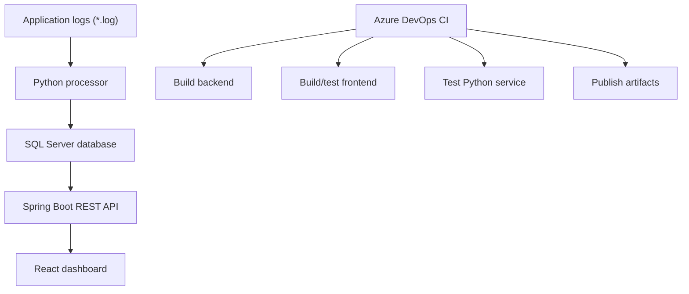

# RTD Azure DevOps Dashboard

Process Monitoring and Automation Dashboard is a lightweight internal full-stack application for viewing service health and recent application events from processed log files.

The project demonstrates a complete local development flow:

```text
Application log files
  -> Python log processor
  -> SQL Server
  -> Spring Boot API
  -> React dashboard
```

## Project Overview

This application helps a developer or small team monitor local/private application activity without switching between log files, terminals, and database tools.

It includes:

- A React dashboard with service status cards and recent events.
- A Spring Boot REST API backed by SQL Server.
- A Python log processor that validates `.log` files and writes events into SQL Server.
- SQL scripts for schema and sample data.
- Basic tests across backend, frontend, and Python.
- A simple Azure DevOps CI pipeline.

## Architecture



## Technology Stack

| Layer | Technology |
|---|---|
| Frontend | React 18, TypeScript, Vite, Vitest, Testing Library |
| Backend | Java 17, Spring Boot 3, Spring Web, Spring Data JPA, Bean Validation |
| Database | SQL Server |
| Python automation | Python 3.11, pyodbc, python-dotenv, pytest |
| CI | Azure DevOps Pipelines |

## Folder Structure

```text
RTD_AzureDevops/
  azure-pipelines.yml
  DESIGN.md
  README.md
  backend/
    src/main/java/com/rtd/dashboard/
    src/test/java/com/rtd/dashboard/
    pom.xml
    .env.example
  database/
    schema.sql
    seed.sql
  docs/
    SETUP.md
    PIPELINE.md
  frontend/
    src/
    package.json
    .env.example
  python-service/
    config/
    logs/
    processor/
    tests/
    validator/
    requirements.txt
    sample_data_generator.py
    .env.example
```

## Prerequisites

- SQL Server running locally or on a reachable host
- `sqlcmd`
- Java 17+
- Maven 3.9+
- Node.js 20+
- Python 3.11+
- ODBC Driver 18 for SQL Server

## Database Setup

Create the database:

```powershell
sqlcmd -S localhost -Q "CREATE DATABASE RTD_AzureDevops"
```

Apply schema and seed data:

```powershell
sqlcmd -S localhost -d RTD_AzureDevops -i database\schema.sql
sqlcmd -S localhost -d RTD_AzureDevops -i database\seed.sql
```

If SQL Server requires SQL authentication:

```powershell
sqlcmd -S localhost -U your_user -P your_password -d RTD_AzureDevops -i database\schema.sql
sqlcmd -S localhost -U your_user -P your_password -d RTD_AzureDevops -i database\seed.sql
```

The schema creates:

- `Services`: current service status.
- `Events`: application event history.
- `LogAnalysis`: Python processor run metadata.

## Backend Setup and Run

Create local environment variables:

```powershell
cd backend
$env:SERVER_PORT="8080"
$env:SPRING_DATASOURCE_URL="jdbc:sqlserver://localhost:1433;databaseName=RTD_AzureDevops;encrypt=true;trustServerCertificate=true"
$env:SPRING_DATASOURCE_USERNAME="your_user"
$env:SPRING_DATASOURCE_PASSWORD="your_password"
$env:CORS_ALLOWED_ORIGIN="http://localhost:3000,http://127.0.0.1:3000"
```

Run the API:

```powershell
mvn spring-boot:run
```

Run backend tests:

```powershell
mvn test
```

## Frontend Setup and Run

```powershell
cd frontend
copy .env.example .env.local
npm install
npm run dev
```

Default frontend config:

```env
VITE_API_URL=http://localhost:8080
VITE_POLL_INTERVAL_MS=30000
VITE_EVENTS_PAGE_SIZE=50
```

Open:

```text
http://localhost:3000
```

Run frontend tests and build:

```powershell
npm test
npm run build
```

## API Documentation

Base URL:

```text
http://localhost:8080
```

### GET `/api/services`

Returns all service status records.

Example:

```powershell
curl.exe http://localhost:8080/api/services
```

Response shape:

```json
[
  {
    "id": 1,
    "serviceName": "spring-api",
    "currentStatus": "UP",
    "lastUpdated": "2026-07-31T17:00:00"
  }
]
```

### GET `/api/events`

Returns paginated events, newest first.

Example:

```powershell
curl.exe "http://localhost:8080/api/events?page=0&size=50"
```

Response shape:

```json
{
  "content": [
    {
      "id": 1,
      "serviceName": "spring-api",
      "eventType": "HEALTH_CHECK",
      "severity": "INFO",
      "message": "API health check passed",
      "timestamp": "2026-07-31T17:00:00"
    }
  ],
  "totalElements": 1,
  "totalPages": 1,
  "number": 0,
  "size": 50
}
```

### POST `/api/events`

Creates a new event.

```powershell
curl.exe -X POST http://localhost:8080/api/events `
  -H "Content-Type: application/json" `
  -d "{\"serviceName\":\"spring-api\",\"eventType\":\"HEALTH_CHECK\",\"severity\":\"INFO\",\"message\":\"API health check passed\",\"timestamp\":\"2026-07-31T17:00:00\"}"
```

Validation:

- `severity` must be `INFO`, `WARNING`, or `ERROR`.
- `serviceName`, `eventType`, `severity`, `message`, and `timestamp` are required.

## Python Automation Usage

Set up the Python environment:

```powershell
cd python-service
python -m venv .venv
.\.venv\Scripts\Activate.ps1
pip install -r requirements.txt
copy .env.example .env
```

Configure `.env`:

```env
DB_SERVER=localhost
DB_NAME=RTD_AzureDevops
DB_USER=your_user
DB_PASSWORD=your_password
DB_DRIVER=ODBC Driver 18 for SQL Server
DB_TRUSTED_CONNECTION=false
LOG_DIR=logs
DEFAULT_SERVICE_NAME=application-log
DEFAULT_EVENT_TYPE=LOG_ENTRY
RETENTION_DAYS=30
LOG_LEVEL=INFO
```

Generate sample logs:

```powershell
python sample_data_generator.py
```

Process logs:

```powershell
python -m processor.log_processor
```

Supported log format:

```text
INFO 2026-07-31 Service started
ERROR 2026-07-31 Database failed
```

Invalid log lines are skipped and counted in `LogAnalysis`.

Run Python tests:

```powershell
python -m pytest
```

## Azure DevOps Pipeline

The CI pipeline is defined in `azure-pipelines.yml`.

It runs on pushes and pull requests to `main` and performs:

1. Repository checkout.
2. Java 17, Node.js 20, and Python 3.11 setup.
3. Maven backend build and tests.
4. Frontend dependency install, tests, and build.
5. Python dependency install and tests.
6. Artifact publishing.

Published artifacts include:

- Backend JAR.
- Frontend static build.
- Python service files.
- Database scripts and documentation.

To enable it:

1. Create an Azure DevOps project.
2. Create a new pipeline.
3. Connect the GitHub repository.
4. Select `azure-pipelines.yml`.
5. Save and run.

## Test Commands

```powershell
cd backend
mvn test
```

```powershell
cd frontend
npm test
npm run build
```

```powershell
cd python-service
python -m pytest
```

## Current Scope Notes

- HTTP Basic authentication is not currently implemented because the backend phase explicitly excluded authentication.
- The Python processor is runnable manually; scheduled execution can be added later with Windows Task Scheduler.
- SQL Server credentials are intentionally loaded from environment variables and are not committed.

## Project Status

The project is complete for the implemented phases:

- Repository foundation
- SQL Server schema and seed data
- Spring Boot API
- React dashboard
- End-to-end integration setup
- Python log processing automation
- Basic tests
- Configuration quality pass
- Azure DevOps CI pipeline
- Final documentation
